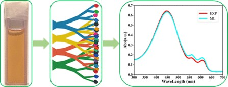

# ARIM-Academy：　機器データ利活用ユースケース
### 機器：紫外可視分光法 (UV-Vis) 
### 分析：回帰分析（k-近傍回帰、ランダムフォレスト、勾配ブースティング等）、重要特徴量評価

## データセット
本研究で使用する『ポリマー溶液の経時変化データセット』（data_all_train.xlsx, data_all_test.xlsx）は、ポリマー溶液の紫外可視分光法（UV-Vis）による経時変化をまとめたものです。[1]

この研究では、溶液画像のRGBから吸光度を予測する機械学習モデルとして、波長と溶液の青（B）、緑（G）、赤（R）の色値を説明変数として用い、ポリマー溶液の劣化を迅速かつ効率的に評価する手法を提案しています。

[1] Haishan Yu, DaDi Zhang, Lei Cui, Yuan Kong and Xuechen Jiao "A Machine Learning Approach for Efficiently Predicting Polymer Aging from UV–Vis Spectra", *J. Phys. Chem. B*, **128**, 38, 9255–9261 (2024).   
https://doi.org/10.1021/acs.jpcb.4c02495

---
   

  

---
**Experimental parameters**  
* WL:　波長 
* B:　青の色値
* G:　緑の色値
* R:　赤の色値
* Abs：吸光度